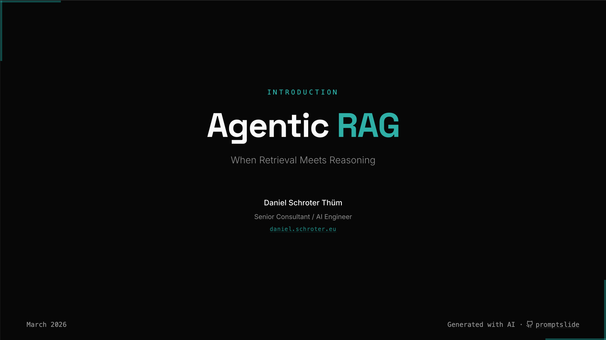
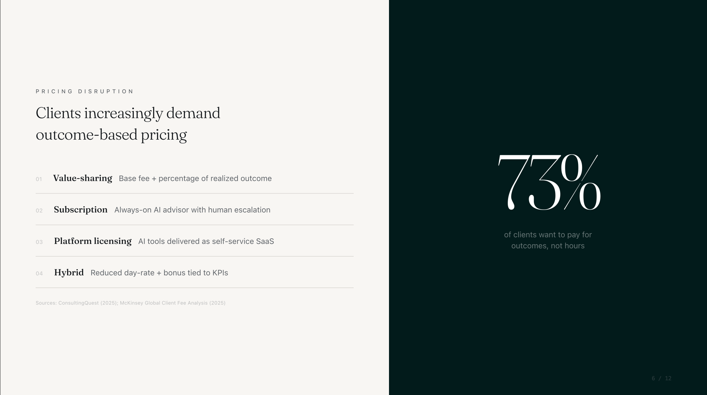
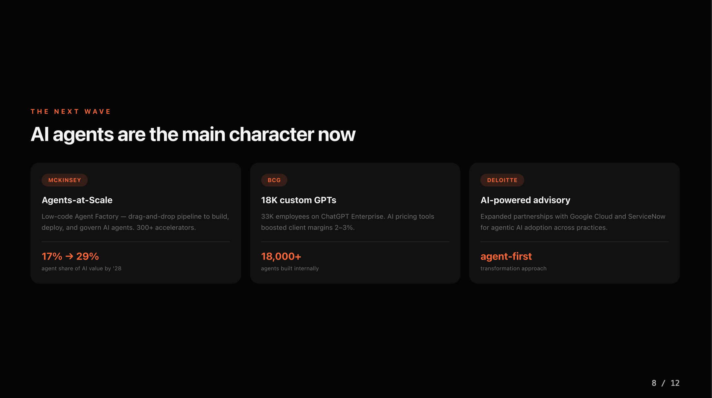
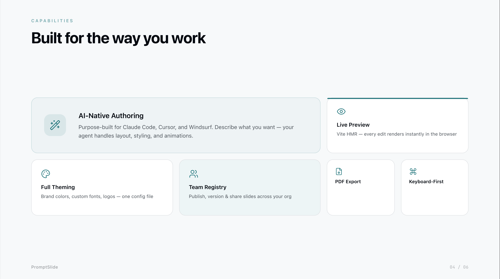

# PromptSlide

**Vibe Coding Slides for your Coding Agents.**

PromptSlide is a local-first slide framework built with React, Tailwind CSS, and Framer Motion. Open your coding agent (Claude Code, Cursor, Windsurf, etc.), describe the slides you want in natural language, and watch them appear in real-time via Vite's hot module replacement.

<table>
  <tr>
    <td></td>
    <td></td>
    <td></td>
  </tr>
  <tr>
    <td></td>
    <td></td>
    <td></td>
  </tr>
</table>

## Install the Skill

```bash
npx skills add prompticeu/promptslide
```

This gives your coding agent everything it needs to create, edit, and publish slide decks. The Skill is also installed automatically when you scaffold a new deck (see below).

## Quick Start

```bash
bun create slides my-deck
cd my-deck
bun install
bun run dev
```

Then open your coding agent and say:

> "Create me a 10-slide deck about AgenticRAG"

The agent uses the [promptslide Skill](https://github.com/prompticeu/promptslide/tree/main/skills/promptslide), generates slide files in `src/slides/`, updates `src/deck-config.ts`, and Vite hot-reloads them instantly.

## How It Works

1. **Install the Skill** — `npx skills add prompticeu/promptslide`
2. **You describe** what you want in natural language
3. **Your coding agent** creates `.tsx` slide files in `src/slides/`
4. **Vite hot-reloads** — slides appear instantly in your browser
5. **Present** in fullscreen or export to PDF

No server, no API, no sandbox. Just a local Vite project + your coding agent.

## Keyboard Shortcuts

| Key           | Action                 |
| ------------- | ---------------------- |
| `→` / `Space` | Next step or slide     |
| `←`           | Previous step or slide |
| `F`           | Toggle fullscreen      |
| `G`           | Toggle grid view       |
| `Escape`      | Exit fullscreen        |

## View Modes

- **Presentation**: Single slide with navigation controls
- **Grid**: Thumbnail overview — click to jump
- **List**: Vertical scroll — use browser print for PDF export

## Tech Stack

- [React 19](https://react.dev)
- [Vite 6](https://vite.dev)
- [Tailwind CSS 4](https://tailwindcss.com)
- [Framer Motion 12](https://motion.dev)
- [Lucide Icons](https://lucide.dev)

## License

MIT
